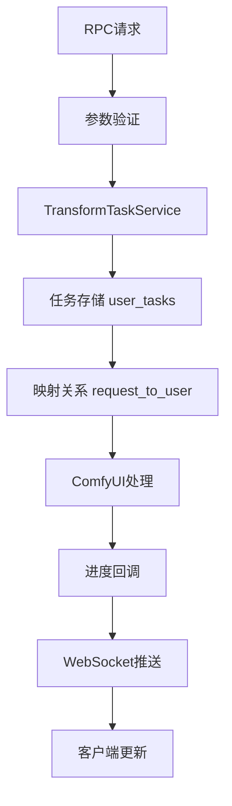

# 请求ID统一化重构设计文档

## 概述

本设计文档详细描述了如何将witness/comfyui_workflow_server系统中的task_id和request_id统一为单一的request_id标识符。重构将涉及RPC方法、数据存储、WebSocket推送和错误处理等多个层面的修改。

## 架构设计

### 当前架构分析

**现有标识符使用情况：**
- `task_id`: 在某些RPC方法中作为任务查询参数
- `request_id`: 作为端到端请求追踪标识符
- 存在双重映射：`request_to_user` 和 `task_to_user`
- 部分代码中task_id和request_id混用

**问题识别：**
1. 标识符语义重复，增加了系统复杂性
2. 需要维护多套映射关系
3. API接口不一致，用户体验差
4. 代码维护成本高

### 目标架构

**统一后的架构：**
- 使用`request_id`作为唯一任务标识符
- 简化数据存储结构
- 统一RPC接口参数
- 简化映射关系管理

## 组件设计

### 1. RPC方法层重构

#### 1.1 参数标准化
```python
# 修改前
@rpc_method("transform.get_status")
async def get_transform_status(params: Dict[str, Any], request: Request):
    user_id = params["user_id"]
    task_id = params["task_id"]  # 旧参数名

# 修改后
@rpc_method("transform.get_status")
async def get_transform_status(params: Dict[str, Any], request: Request):
    user_id = params["user_id"]
    request_id = params["request_id"]  # 统一参数名
```

#### 1.2 受影响的RPC方法
- `transform.get_status`
- `transform.get_result`
- `transform.cancel`
- `transform.list` (返回数据结构调整)

#### 1.3 参数验证更新
```python
# 新增request_id验证方法
class RPCValidator:
    @staticmethod
    def validate_request_id(request_id: str) -> str:
        """验证并清理request_id"""
        if not request_id or not isinstance(request_id, str):
            raise RPCError(code=ErrorCodes.INVALID_PARAMS, 
                         message="request_id必须是非空字符串")
        return request_id.strip()
```

### 2. 数据存储层重构

#### 2.1 TransformTaskService存储结构
```python
class TransformTaskService:
    def __init__(self, ...):
        # 简化存储结构
        self.user_tasks: Dict[str, Dict[str, UserTaskData]] = {}  # {user_id: {request_id: task_data}}
        self.request_to_user: Dict[str, str] = {}  # {request_id: user_id}
        self.prompt_to_request: Dict[str, str] = {}  # {prompt_id: request_id}
        
        # 移除不再需要的映射
        # self.task_to_user: Dict[str, str] = {}  # 删除
        # self.prompt_to_task: Dict[str, str] = {}  # 删除
```

#### 2.2 UserTaskData模型调整
```python
@dataclass
class UserTaskData:
    # 统一使用request_id
    request_id: str  # 主标识符
    user_id: str
    style_id: str
    status: str
    # ... 其他字段保持不变
    
    @property
    def task_id(self) -> str:
        """向后兼容属性，返回request_id"""
        return self.request_id
```

### 3. 服务层接口重构

#### 3.1 方法签名更新
```python
class TransformTaskService:
    def get_user_task(self, user_id: str, request_id: str) -> Optional[UserTaskData]:
        """使用request_id获取任务"""
        
    async def cancel_task(self, user_id: str, request_id: str) -> bool:
        """使用request_id取消任务"""
        
    def handle_progress_update(self, prompt_id: str, progress_data: Dict[str, Any]):
        """处理进度更新，内部使用request_id"""
```

#### 3.2 映射关系简化
```python
# 简化映射逻辑
def _get_request_id_from_prompt(self, prompt_id: str) -> Optional[str]:
    """直接从prompt_id获取request_id"""
    return self.prompt_to_request.get(prompt_id)

def _get_user_id_from_request(self, request_id: str) -> Optional[str]:
    """从request_id获取user_id"""
    return self.request_to_user.get(request_id)
```

### 4. WebSocket推送层重构

#### 4.1 消息格式标准化
```python
# 统一推送消息格式
async def _push_task_update(self, task_data: UserTaskData):
    update_data = {
        "type": "task_update",
        "request_id": task_data.request_id,  # 使用request_id
        "user_id": task_data.user_id,
        "style_id": task_data.style_id,
        "status": task_data.status,
        "progress": task_data.progress,
        "message": getattr(task_data, 'message', ''),
        "timestamp": time.time()
    }
    
    await push_manager.push_task_update(task_data.request_id, update_data)
```

#### 4.2 推送管理器更新
```python
class WebSocketPushManager:
    async def push_task_update(self, request_id: str, update_data: Dict[str, Any]):
        """使用request_id进行推送"""
        user_id = update_data.get("user_id")
        if user_id and user_id in self.connections:
            # 推送逻辑保持不变，但确保使用request_id
```

### 5. 错误处理和日志重构

#### 5.1 日志标准化
```python
# 统一日志格式
logger.info(f"创建转换任务: {request_id}, 用户: {user_id}, 风格: {style_id}")
logger.error(f"请求 {request_id} 失败: {error_message}")
logger.debug(f"请求 {request_id} 进度更新: {progress}%")
```

#### 5.2 错误消息更新
```python
# 错误消息中包含request_id
raise RPCError(
    code=ErrorCodes.TASK_NOT_FOUND,
    message="任务不存在",
    data={"user_id": user_id, "request_id": request_id}
)
```

## 数据模型

### 核心数据流


### 数据存储结构
```python
# 简化后的存储结构
{
    "user_tasks": {
        "user123": {
            "req-abc-123": UserTaskData(...),
            "req-def-456": UserTaskData(...)
        }
    },
    "request_to_user": {
        "req-abc-123": "user123",
        "req-def-456": "user123"
    },
    "prompt_to_request": {
        "prompt_789": "req-abc-123"
    }
}
```

## 错误处理

### 错误分类和处理策略

#### 1. 参数验证错误
- **错误码**: 1001-1099
- **处理**: 返回清晰的错误消息，指导正确的参数格式
- **示例**: "request_id参数缺失，请提供有效的request_id"

#### 2. 任务不存在错误
- **错误码**: 3001
- **处理**: 返回任务不存在错误，包含用户ID和request_id
- **示例**: "任务不存在: user_id=user123, request_id=req-abc-123"

#### 3. 向后兼容错误
- **错误码**: 1002
- **处理**: 当检测到旧的task_id参数时，返回迁移指导
- **示例**: "参数task_id已废弃，请使用request_id参数"

## 测试策略

### 单元测试覆盖
1. **RPC方法测试**: 验证所有方法都接受request_id参数
2. **数据存储测试**: 验证基于request_id的CRUD操作
3. **映射关系测试**: 验证简化后的映射逻辑
4. **WebSocket推送测试**: 验证消息格式的一致性

### 集成测试场景
1. **端到端任务流程**: 从创建到完成的完整流程
2. **并发任务处理**: 多个request_id的并发处理
3. **错误场景测试**: 各种错误情况的处理
4. **性能回归测试**: 确保重构后性能不下降

### 兼容性测试
1. **API向后兼容**: 测试旧参数的错误处理
2. **数据迁移测试**: 验证历史数据的处理
3. **客户端适配测试**: 验证客户端代码的适配

## 部署策略

### 分阶段部署
1. **阶段1**: 后端重构，保持API兼容
2. **阶段2**: 更新API文档和错误消息
3. **阶段3**: 客户端代码更新
4. **阶段4**: 移除兼容性代码

### 回滚计划
- 保留原有代码分支
- 准备快速回滚脚本
- 监控关键指标
- 准备紧急修复流程

## 性能考虑

### 优化点
1. **减少映射查找**: 简化标识符映射减少查找开销
2. **内存使用优化**: 减少重复数据存储
3. **查询效率**: 统一标识符提高查询效率

### 性能指标
- API响应时间: < 100ms (95th percentile)
- 内存使用: 减少10-15%
- 并发处理能力: 保持现有水平

## 监控和观测

### 关键指标
1. **API调用成功率**: 监控重构后的API稳定性
2. **任务处理时间**: 监控端到端处理时间
3. **错误率**: 监控各类错误的发生频率
4. **资源使用**: 监控CPU和内存使用情况

### 日志和追踪
- 统一使用request_id进行日志关联
- 添加重构相关的监控指标
- 设置关键操作的告警阈值