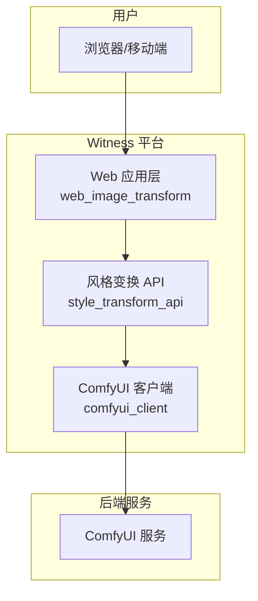

# Witness: 图像风格变换平台

Witness 是一个完整的、分层的图像风格变换平台，它集成了强大的 [ComfyUI](https://github.com/comfyanonymous/ComfyUI) 作为图像生成后端。该项目通过将复杂的工作流封装在易于使用的 Web 界面和 API 之后，为用户和开发者提供了便捷的图像处理能力。

本平台经过专门设计，具备高度的健壮性，即使后端 ComfyUI 服务暂时不可用，核心API服务也能够独立启动和运行。

## 系统架构

本项目采用三层架构设计，各组件职责分明：

1.  **Web 应用层 (`web_image_transform`)**:
    *   一个基于 FastAPI 的用户友好 Web 界面，用于上传图片、选择风格、提交任务并查看结果。
    *   通过 WebSocket 提供实时的任务进度更新。
    *   是最终用户与系统交互的入口。

2.  **风格变换 API 层 (`style_transform_api`)**:
    *   核心业务逻辑层，同样基于 FastAPI。
    *   负责接收来自上层应用的请求，管理变换任务队列，并与 ComfyUI 服务进行通信。
    *   它将复杂的 ComfyUI工作流（如 `style_change.json`）抽象为简单的 API 调用。

3.  **ComfyUI 客户端 (`comfyui_client`)**:
    *   一个轻量级的 Python 客户端库，封装了对 ComfyUI 原生 HTTP 和 WebSocket API 的调用。
    *   为 `style_transform_api` 提供了与 ComfyUI 通信的标准化接口。



## 目录结构

```
witness/
├── web_image_transform/    # Web应用前端和服务
├── style_transform_api/    # 核心业务API
├── comfyui_client/         # ComfyUI的Python客户端
├── workflows/              # ComfyUI工作流模板
├── docs/                   # 项目文档
└── requirements.txt        # 项目总依赖
```

## 快速开始

### 环境要求
- Python 3.8+
- 一个正在运行的 ComfyUI 实例 (可选，用于执行实际的图像变换任务)

### 安装依赖

从项目根目录 `witness/` 下安装所有必要的 Python 依赖：

```bash
pip install -r requirements.txt
```

### 运行项目

所有服务都应从项目的根目录 `witness/` 中启动。请按以下顺序独立运行每个服务：

1.  **启动 Style Transform API**
    此服务现在具备容错能力，即使无法连接到 ComfyUI 也能启动。
    ```bash
    # 在 witness/ 根目录下运行
    # (根据需要配置 style_transform_api/.env 文件)
    uvicorn style_transform_api.app.main:app --host 0.0.0.0 --port 8000
    ```

2.  **启动 Web Image Transform 应用**
    ```bash
    # 在 witness/ 根目录下运行
    # (根据需要配置 web_image_transform/.env 文件，确保 STYLE_API_BASE_URL 指向步骤1的服务)
    uvicorn web_image_transform.app.main:app --host 0.0.0.0 --port 8080
    ```
之后，在浏览器中访问 `http://localhost:8080` 即可使用。

## 文档

- **[ComfyUI API 技术参考](./docs/comfyui_api.md)**: 底层 ComfyUI API 的详细技术文档。

---
此README整合了项目的总体视图。有关每个子模块的更多详细信息，请参阅其各自目录中的 `README.md` 文件。 