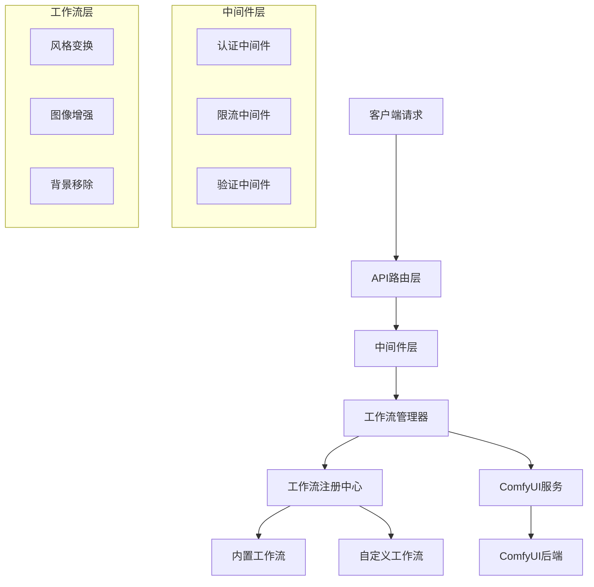

# ComfyUI工作流服务器

一个基于FastAPI的通用AI工作流执行平台，专为ComfyUI设计。本服务器提供了强大的工作流管理、任务执行和API接口能力。

## ✨ 核心特性

- **🚀 通用工作流架构** - 支持多种AI图像处理工作流
- **🔄 自动工作流发现** - 自动注册和管理工作流
- **📊 实时任务监控** - 完整的任务生命周期管理
- **🛡️ 安全与限流** - API密钥认证和智能限流
- **🔧 可扩展设计** - 易于添加新的工作流类型
- **💪 健壮性** - 即使ComfyUI服务不可用也能启动

## 🏗️ 架构概览



### 核心组件

- **工作流注册中心 (WorkflowRegistry)**: 自动发现、注册和管理所有工作流
- **工作流管理器 (WorkflowManager)**: 处理任务执行、状态管理和结果处理
- **ComfyUI服务 (ComfyUIService)**: 与ComfyUI后端的通信接口
- **中间件系统**: 提供认证、限流、验证等功能

## 🚀 快速开始

### 环境要求

- Python 3.8+
- ComfyUI 实例 (推荐但非必需)

### 安装依赖

```bash
pip install -r requirements.txt
```

### 配置服务

复制环境配置模板：

```bash
cp env.example .env
```

编辑 `.env` 文件：

```env
# 基本配置
APP_NAME=ComfyUI工作流服务器
DEBUG=false
HOST=0.0.0.0
PORT=8000

# ComfyUI配置
COMFYUI_BASE_URL=http://localhost:8188
COMFYUI_TIMEOUT=300

# 安全配置
API_KEY=your-secret-api-key

# 限流配置
RATE_LIMIT_PER_MINUTE=60
RATE_LIMIT_PER_HOUR=1000
```

### 启动服务

```bash
# 使用start.py脚本
python start.py

# 或直接使用uvicorn
uvicorn app.main:app --host 0.0.0.0 --port 8000
```

### 验证安装

访问以下端点验证服务状态：

```bash
# 健康检查
curl http://localhost:8000/health

# 获取可用工作流
curl http://localhost:8000/api/v1/workflows/

# API文档
浏览器访问 http://localhost:8000/docs
```

## 📖 API 使用指南

### 核心端点

#### 1. 列出所有工作流

```bash
GET /api/v1/workflows/
```

**响应示例:**
```json
{
  "success": true,
  "data": ["style_transform", "image_upscale", "background_removal"]
}
```

#### 2. 获取工作流详情

```bash
GET /api/v1/workflows/{workflow_id}
```

**响应示例:**
```json
{
  "success": true,
  "data": {
    "id": "style_transform",
    "name": "风格变换",
    "description": "将输入图像转换为指定风格的图像",
    "version": "1.0.0",
    "workflow_type": "image_to_image",
    "parameter_schema": {...}
  }
}
```

#### 3. 执行工作流

```bash
POST /api/v1/workflows/{workflow_id}/execute
Content-Type: application/json
X-API-Key: your-api-key

{
  "workflow_id": "style_transform",
  "parameters": {
    "image": "input_image.jpg",
    "style_prompt": "油画风格，温暖色调",
    "strength": 0.8,
    "steps": 20
  }
}
```

**响应示例:**
```json
{
  "success": true,
  "data": "task-uuid-12345"
}
```

#### 4. 查询任务状态

```bash
GET /api/v1/workflows/tasks/{task_id}
```

**响应示例:**
```json
{
  "success": true,
  "data": {
    "id": "task-uuid-12345",
    "workflow_id": "style_transform",
    "status": "running",
    "progress": 0.65,
    "created_at": "2024-01-15T10:30:00",
    "estimated_time": 45
  }
}
```

#### 5. 获取任务结果

```bash
GET /api/v1/workflows/tasks/{task_id}/result
```

**响应示例:**
```json
{
  "success": true,
  "data": {
    "id": "task-uuid-12345",
    "status": "completed",
    "result": {
      "output_images": [
        {
          "filename": "output_001.png",
          "url": "http://localhost:8188/view?filename=output_001.png"
        }
      ]
    }
  }
}
```

### 错误处理

所有错误响应遵循统一格式：

```json
{
  "success": false,
  "error_code": "VALIDATION_ERROR",
  "error_message": "参数验证失败",
  "details": {
    "field": "style_prompt",
    "path": "/api/v1/workflows/style_transform/execute",
    "method": "POST"
  }
}
```

## 🔧 工作流开发

### 创建自定义工作流

1. **创建工作流类**

在 `app/workflows/custom/` 目录下创建新的工作流文件：

```python
# app/workflows/custom/my_workflow.py
from ..base import BaseWorkflow, WorkflowMetadata, WorkflowParameter, WorkflowType
from typing import Dict, Any

class MyCustomWorkflow(BaseWorkflow):
    def get_metadata(self) -> WorkflowMetadata:
        return WorkflowMetadata(
            id="my_custom_workflow",
            name="我的自定义工作流",
            description="这是一个示例自定义工作流",
            version="1.0.0",
            workflow_type=WorkflowType.CUSTOM,
            parameters=[
                WorkflowParameter(
                    name="input_text",
                    type="string",
                    required=True,
                    description="输入文本"
                ),
                WorkflowParameter(
                    name="iterations",
                    type="integer",
                    required=False,
                    default=10,
                    min_value=1,
                    max_value=100,
                    description="迭代次数"
                )
            ]
        )
    
    def validate_parameters(self, parameters: Dict[str, Any]) -> Dict[str, Any]:
        # 实现参数验证逻辑
        validated = {}
        # ... 验证逻辑
        return validated
    
    async def build_workflow(self, parameters: Dict[str, Any]) -> Dict[str, Any]:
        # 构建ComfyUI工作流JSON
        workflow = {
            # ... ComfyUI工作流定义
        }
        return workflow
```

2. **工作流自动发现**

工作流注册中心会自动发现并注册新的工作流类。重启服务后，新工作流将自动可用。

### 参数类型支持

支持的参数类型：

- `string`: 字符串类型
- `number`: 浮点数类型
- `integer`: 整数类型
- `boolean`: 布尔类型
- `enum`: 枚举类型
- `image`: 图像文件类型
- `array`: 数组类型

### 工作流类型

预定义的工作流类型：

- `IMAGE_TO_IMAGE`: 图像到图像转换
- `TEXT_TO_IMAGE`: 文本到图像生成
- `IMAGE_UPSCALE`: 图像放大
- `BACKGROUND_REMOVAL`: 背景移除
- `VIDEO_GENERATION`: 视频生成
- `AUDIO_GENERATION`: 音频生成
- `CUSTOM`: 自定义类型

## ⚙️ 配置参考

### 环境变量

| 变量名 | 类型 | 默认值 | 说明 |
|--------|------|--------|------|
| `APP_NAME` | string | ComfyUI工作流服务器 | 应用名称 |
| `APP_VERSION` | string | 1.0.0 | 应用版本 |
| `DEBUG` | boolean | false | 调试模式 |
| `HOST` | string | 0.0.0.0 | 服务器地址 |
| `PORT` | integer | 8000 | 服务器端口 |
| `COMFYUI_BASE_URL` | string | http://localhost:8188 | ComfyUI服务地址 |
| `COMFYUI_TIMEOUT` | integer | 300 | ComfyUI请求超时时间 |
| `API_KEY` | string | None | API密钥(可选) |
| `RATE_LIMIT_PER_MINUTE` | integer | 60 | 每分钟请求限制 |
| `RATE_LIMIT_PER_HOUR` | integer | 1000 | 每小时请求限制 |
| `MAX_CONCURRENT_TASKS` | integer | 10 | 最大并发任务数 |

### 中间件配置

#### 认证中间件
- 支持API密钥认证
- 可通过请求头 `X-API-Key` 或 `Authorization: Bearer` 传递
- 如未配置API_KEY则跳过认证

#### 限流中间件
- 基于IP和用户的双重限流
- 支持指数退避阻塞机制
- 可配置每分钟/每小时限制

#### 验证中间件
- 自动验证JSON格式
- 检查Content-Type
- 防止SSRF攻击

## 🐳 Docker 部署

### 构建镜像

```bash
docker build -t comfyui-workflow-server .
```

### 运行容器

```bash
docker run -d \
  --name workflow-server \
  -p 8000:8000 \
  -e COMFYUI_BASE_URL=http://comfyui:8188 \
  -e API_KEY=your-secret-key \
  comfyui-workflow-server
```

### Docker Compose

```yaml
version: '3.8'
services:
  workflow-server:
    build: .
    ports:
      - "8000:8000"
    environment:
      - COMFYUI_BASE_URL=http://comfyui:8188
      - API_KEY=your-secret-key
    depends_on:
      - comfyui
      
  comfyui:
    image: comfyui/comfyui:latest
    ports:
      - "8188:8188"
```

## 📊 监控与日志

### 健康检查端点

```bash
GET /health
```

返回服务健康状态，包括：
- ComfyUI连接状态
- 系统资源使用情况
- 限流统计信息

### 监控端点

```bash
GET /monitoring/stats
GET /monitoring/performance
GET /monitoring/tasks
```

### 日志配置

日志级别通过 `LOG_LEVEL` 环境变量配置：
- `DEBUG`: 详细调试信息
- `INFO`: 一般信息(默认)
- `WARNING`: 警告信息
- `ERROR`: 错误信息

## 🔧 故障排除

### 常见问题

1. **服务启动失败**
   - 检查端口是否被占用
   - 验证配置文件语法
   - 查看日志文件

2. **ComfyUI连接失败**
   - 验证 `COMFYUI_BASE_URL` 配置
   - 检查ComfyUI服务是否运行
   - 确认网络连通性

3. **工作流执行失败**
   - 检查工作流参数是否正确
   - 验证ComfyUI模型是否已加载
   - 查看任务错误信息

4. **API认证失败**
   - 确认API密钥配置正确
   - 检查请求头格式
   - 验证密钥是否过期

### 调试模式

启用调试模式获取详细日志：

```bash
export DEBUG=true
python start.py
```

## 🤝 贡献指南

欢迎贡献代码！请遵循以下步骤：

1. Fork 项目
2. 创建功能分支
3. 提交更改
4. 创建 Pull Request

### 代码规范

- 使用 Python 3.8+ 语法
- 遵循 PEP 8 编码规范
- 添加类型注解
- 编写测试用例

## 📄 许可证

本项目采用 MIT 许可证。详见 [LICENSE](LICENSE) 文件。

## 🔗 相关链接

- [ComfyUI 官方文档](https://github.com/comfyanonymous/ComfyUI)
- [FastAPI 文档](https://fastapi.tiangolo.com/)
- [项目GitHub仓库](https://github.com/your-org/witness)

---

**注意**: 本服务器设计为与ComfyUI配合使用，但具备独立运行能力。即使ComfyUI服务不可用，API服务也能正常启动和响应基本请求。 