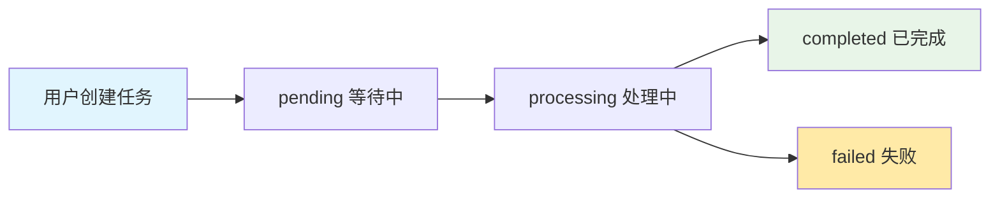

# ComfyUI Workflow Server API 接入文档

## 📋 目录

- [API 概览](#api-概览)
  - [多用户架构](#-多用户架构)
- [快速开始](#快速开始)
  - [多用户配置](#多用户配置)
- [认证流程](#认证流程)
- [API 模块详解](#api-模块详解)
  - [认证模块](#认证模块)
  - [风格管理模块](#风格管理模块)
  - [任务管理模块](#任务管理模块)
  - [文件管理模块](#文件管理模块)
- [WebSocket 实时推送](#websocket-实时推送)
- [错误处理](#错误处理)
- [代码示例](#代码示例)
  - [多用户使用示例](#多用户使用示例)
- [最佳实践](#最佳实践)
  - [多用户管理](#多用户管理)

---

## 🚀 API 概览

ComfyUI Workflow Server 提供了一套完整的 **多用户** RESTful API 和 WebSocket 实时推送服务，用于AI图像风格转换和工作流管理。

### 基础信息

- **基础URL**: `http://your-domain:8000/api/v1`
- **API版本**: v1
- **数据格式**: JSON
- **认证方式**: JWT Bearer Token
- **安全防护**: 五层安全防护体系（可配置）
- **多用户支持**: ✅ 完整的多租户架构

### 功能特性

- 🔐 **安全认证**: JWT令牌 + API密钥双重认证
- 👥 **多用户支持**: 完整的用户隔离和权限管理
- 🎨 **风格管理**: 风格发现、搜索和应用
- 📋 **任务管理**: 异步任务处理和状态跟踪（按用户隔离）
- 📁 **文件管理**: 用户文件上传、管理和存储（按用户隔离）
- 🔌 **实时推送**: WebSocket 任务状态实时更新
- 📊 **监控统计**: 详细的使用统计和性能监控
- 👑 **管理员功能**: 系统管理和维护接口

### 🏗️ 多用户架构

#### 用户权限体系

| 用户类型 | 权限说明 | 可用功能 |
|----------|----------|----------|
| **普通用户** | 基础操作权限 | 风格查询、任务管理、文件管理、个人统计 |
| **管理员** | 系统管理权限 | 普通用户权限 + 文件清理、系统监控、全局管理 |

#### 数据隔离机制

- **文件隔离**: 每个用户拥有独立的上传和输出目录 (`/uploads/{user_id}/`, `/outputs/{user_id}/`)
- **任务隔离**: 用户只能查看和管理自己的任务
- **资源配额**: 每用户文件存储限制和任务并发限制
- **权限验证**: 所有 API 调用都进行用户身份和权限验证

---

## ⚡ 快速开始

### 1. 获取 API 密钥

请联系系统管理员获取您的 API 密钥和用户名。

#### 多用户配置

系统管理员通过环境变量 `API_USERS` 配置多个用户：

```json
{
  "user_api_key_1": {
    "username": "alice",
    "permissions": ["read", "write"]
  },
  "user_api_key_2": {
    "username": "bob", 
    "permissions": ["read", "write"]
  },
  "admin_api_key": {
    "username": "admin",
    "permissions": ["read", "write", "admin"]
  }
}
```

每个用户将获得：
- **用户名**: 用于身份标识
- **API密钥**: 用于请求认证（同时作为密码）
- **权限列表**: 定义用户可执行的操作
- **独立资源**: 独立的文件存储空间和任务管理

### 2. 基础请求示例

```bash
# 获取访问令牌
curl -X POST "http://your-domain:8000/api/v1/auth/token" \
     -H "Content-Type: application/x-www-form-urlencoded" \
     -H "x-api-key: your-api-key" \
     -H "x-timestamp: $(date +%s)" \
     -H "x-signature: your-signature" \
     -d "username=your-username&password=your-api-key"
```

### 3. 签名生成

```python
import hmac
import hashlib
import time

def generate_signature(secret_key: str, timestamp: str, method: str, path: str, query: str = "", body_hash: str = ""):
    sign_content = f"{timestamp}{method}{path}{query}{body_hash}"
    signature = hmac.new(
        secret_key.encode(),
        sign_content.encode(),
        hashlib.sha256
    ).hexdigest()
    return signature
```

---

## 🔐 认证流程

### 安全头部要求

所有API请求都需要包含以下安全头部：

```http
x-api-key: your-api-key
x-timestamp: 1640995200
x-signature: generated-hmac-signature
Authorization: Bearer jwt-token  # 受保护端点需要
```

### 认证步骤

1. **生成时间戳**: 当前Unix时间戳
2. **计算签名**: 使用HMAC-SHA256算法
3. **获取JWT令牌**: 通过认证端点获取
4. **使用令牌**: 在后续请求中携带Bearer令牌

### 签名计算详解

```python
# 签名内容组成
sign_content = timestamp + method + path + query + body_hash

# 示例
timestamp = "1640995200"
method = "POST"
path = "/api/v1/auth/token"
query = ""
body_hash = hashlib.sha256(body_bytes).hexdigest()

sign_content = f"{timestamp}{method}{path}{query}{body_hash}"
signature = hmac.new(secret_key.encode(), sign_content.encode(), hashlib.sha256).hexdigest()
```

---

## 📚 API 模块详解

### 认证模块

#### 获取访问令牌

**端点**: `POST /api/v1/auth/token`

**描述**: 使用用户名和API密钥获取JWT访问令牌。

**请求格式**:
```http
Content-Type: application/x-www-form-urlencoded
```

**请求参数**:
```
username=your-username
password=your-api-key
```

**响应示例**:
```json
{
  "access_token": "eyJhbGciOiJIUzI1NiIsInR5cCI6IkpXVCJ9...",
  "token_type": "bearer"
}
```

---

### 风格管理模块

#### 1. 获取所有风格

**端点**: `GET /api/v1/styles/`

**描述**: 获取所有可用的风格列表。

**响应示例**:
```json
[
  {
    "id": "anime_style",
    "name": "动漫风格",
    "description": "将图像转换为动漫风格",
    "category": "artistic",
    "preview_url": "/static/previews/anime_style.jpg"
  }
]
```

#### 2. 搜索风格

**端点**: `GET /api/v1/styles/search?q={keyword}`

**参数**:
- `q` (string, required): 搜索关键词

**响应**: 与获取所有风格相同的格式

#### 3. 获取风格详情

**端点**: `GET /api/v1/styles/{style_id}`

**参数**:
- `style_id` (string, required): 风格ID

**响应示例**:
```json
{
  "id": "anime_style",
  "name": "动漫风格",
  "description": "将图像转换为动漫风格",
  "category": "artistic",
  "preview_url": "/static/previews/anime_style.jpg",
  "parameters": {
    "strength": 0.8,
    "steps": 20
  }
}
```

#### 4. 提交风格转换任务

**端点**: `POST /api/v1/styles/transform`

**请求体**:
```json
{
  "style_id": "anime_style",
  "image_url": "http://your-domain/uploads/user123/image.jpg"
}
```

**响应示例**:
```json
{
  "task_id": "task_12345",
  "status": "pending",
  "created_at": 1640995200,
  "style_id": "anime_style",
  "input_image_path": "/uploads/user123/image.jpg"
}
```

---

### 任务管理模块

> 📢 **多用户隔离**: 用户只能创建、查看和管理自己的任务，无法访问其他用户的任务。

#### 任务生命周期



#### 1. 创建任务

**端点**: `POST /api/v1/tasks/`

**请求体**:
```json
{
  "style_id": "anime_style",
  "image_url": "http://your-domain/uploads/user123/image.jpg"
}
```

**响应状态码**: `202 Accepted`

#### 2. 获取任务列表

**端点**: `GET /api/v1/tasks/?limit=100`

**参数**:
- `limit` (integer, optional): 返回任务数量限制 (1-1000)

**响应示例**:
```json
[
  {
    "task_id": "task_12345",
    "status": "completed",
    "created_at": 1640995200,
    "started_at": 1640995205,
    "completed_at": 1640995300,
    "style_id": "anime_style",
    "input_image_path": "/uploads/user123/image.jpg",
    "progress": 100
  }
]
```

#### 3. 获取任务详情

**端点**: `GET /api/v1/tasks/{task_id}`

**响应**: 与任务列表中的单个任务相同格式

#### 4. 获取任务结果

**端点**: `GET /api/v1/tasks/{task_id}/result`

**描述**: 仅在任务状态为 `completed` 时可用。

**响应示例**:
```json
{
  "success": true,
  "data": {
    "output_images": [
      {
        "filename": "output_12345.jpg",
        "url": "/view?filename=output_12345.jpg&subfolder=user123&type=output",
        "size": 1024000
      }
    ],
    "duration": 95.5,
    "style_applied": "anime_style"
  }
}
```

#### 5. 取消任务

**端点**: `DELETE /api/v1/tasks/{task_id}`

**响应示例**:
```json
{
  "success": true,
  "data": {
    "message": "任务取消功能待实现"
  }
}
```

---

### 文件管理模块

> 📢 **多用户隔离**: 所有文件操作都在用户独立的命名空间中进行，用户只能访问自己的文件。

#### 文件存储结构

```
uploads/
├── alice/          # 用户alice的上传文件
│   ├── file_001.jpg
│   └── file_002.png
├── bob/            # 用户bob的上传文件
│   └── file_003.jpg
└── admin/          # 管理员的上传文件

outputs/
├── alice/          # 用户alice的输出文件
│   ├── task_123_output.jpg
│   └── task_124_output.png
├── bob/            # 用户bob的输出文件
└── admin/          # 管理员的输出文件
```

#### 1. 上传文件

**端点**: `POST /api/v1/files/upload`

**请求格式**: `multipart/form-data`

**文件限制**:
- 最大大小: 10MB
- 支持格式: .jpg, .jpeg, .png, .gif, .bmp, .webp
- **用户隔离**: 文件自动保存到用户专属目录

**请求示例**:
```bash
curl -X POST "http://your-domain:8000/api/v1/files/upload" \
     -H "Authorization: Bearer your-jwt-token" \
     -H "x-api-key: your-api-key" \
     -H "x-timestamp: $(date +%s)" \
     -H "x-signature: your-signature" \
     -F "file=@/path/to/your/image.jpg"
```

**响应示例**:
```json
{
  "file_id": "file_67890",
  "filename": "image.jpg",
  "url": "/uploads/user123/file_67890.jpg",
  "size": 512000,
  "uploaded_at": 1640995200,
  "user_id": "user123"
}
```

#### 2. 获取文件列表

**端点**: `GET /api/v1/files/?limit=100`

**响应示例**:
```json
{
  "success": true,
  "user_id": "user123",
  "files": [
    {
      "file_id": "file_67890",
      "filename": "image.jpg",
      "url": "/uploads/user123/file_67890.jpg",
      "size": 512000,
      "uploaded_at": 1640995200
    }
  ],
  "total": 1
}
```

#### 3. 获取文件信息

**端点**: `GET /api/v1/files/{file_id}`

**响应**: 与文件列表中的单个文件相同格式

#### 4. 删除文件

**端点**: `DELETE /api/v1/files/{file_id}`

**响应示例**:
```json
{
  "success": true,
  "data": {
    "message": "文件 file_67890 已成功删除"
  }
}
```

#### 5. 获取文件统计

**端点**: `GET /api/v1/files/stats`

**响应示例**:
```json
{
  "success": true,
  "data": {
    "total_files": 25,
    "storage_used_bytes": 52428800,
    "storage_used_mb": 50.0
  }
}
```

#### 6. 清理过期文件 (管理员专用)

**端点**: `POST /api/v1/files/cleanup?max_age_hours=24`

**权限**: 🚨 **仅管理员用户** - 需要 `admin` 权限

**描述**: 全局清理所有用户的过期文件，这是一个系统级操作。

**参数**:
- `max_age_hours` (integer, optional): 文件保留时间阈值，默认24小时

**响应示例**:
```json
{
  "success": true,
  "data": {
    "message": "清理任务已成功触发，将清理超过 24 小时的文件。"
  }
}
```

> ⚠️ **管理员操作注意事项**:
> - 此操作会影响所有用户的文件
> - 建议在系统维护期间执行
> - 操作不可逆，请谨慎使用

---

## 🔌 WebSocket 实时推送

> 📢 **多用户隔离**: WebSocket 推送系统支持多客户端连接，每个客户端将收到所有用户的任务状态更新。客户端需要根据用户身份过滤相关消息。

### 连接地址

```
ws://your-domain:8000/api/v1/ws/push/{client_id}
```

### 连接参数

- `client_id` (string): 唯一的客户端标识符（建议包含用户信息，如 `alice_web_001`）

### 消息格式

**任务状态更新**:
```json
{
  "type": "task_update",
  "task_id": "task_12345",
  "data": {
    "status": "processing",
    "progress": 45,
    "message": "正在处理图像...",
    "updated_at": 1640995250
  }
}
```

### JavaScript 示例

```javascript
// 多用户WebSocket连接示例
class MultiUserWebSocketClient {
    constructor(currentUserId) {
        this.currentUserId = currentUserId;
        this.clientId = `${currentUserId}_web_${Date.now()}`;
        this.ws = null;
        this.connect();
    }
    
    connect() {
        this.ws = new WebSocket(`ws://your-domain:8000/api/v1/ws/push/${this.clientId}`);
        
        this.ws.onopen = (event) => {
            console.log(`用户 ${this.currentUserId} WebSocket连接已建立`);
        };
        
        this.ws.onmessage = (event) => {
            const message = JSON.parse(event.data);
            console.log('收到消息:', message);
            
            if (message.type === 'task_update') {
                // 多用户环境下需要检查任务归属
                this.handleTaskUpdate(message.task_id, message.data);
            }
        };
        
        this.ws.onclose = (event) => {
            console.log(`用户 ${this.currentUserId} WebSocket连接已关闭`);
        };
        
        this.ws.onerror = (error) => {
            console.error(`用户 ${this.currentUserId} WebSocket错误:`, error);
        };
    }
    
    handleTaskUpdate(taskId, updateData) {
        // 在多用户环境中，客户端需要验证任务归属
        // 通常任务ID会包含用户信息，或者需要从本地存储的任务列表中验证
        if (this.isMyTask(taskId)) {
            this.updateTaskStatus(taskId, updateData);
        }
    }
    
    isMyTask(taskId) {
        // 实现任务归属检查逻辑
        // 可以检查任务ID前缀、本地任务列表等
        return this.myTasks.includes(taskId);
    }
    
    updateTaskStatus(taskId, updateData) {
        console.log(`用户 ${this.currentUserId} 的任务 ${taskId} 状态更新:`, updateData);
        // 更新UI逻辑
    }
}

// 使用示例
const currentUser = 'alice';
const wsClient = new MultiUserWebSocketClient(currentUser);

// 发送心跳包保持连接
setInterval(() => {
    if (wsClient.ws && wsClient.ws.readyState === WebSocket.OPEN) {
        wsClient.ws.send('ping');
    }
}, 30000);
```

### Python 示例

```python
import asyncio
import websockets
import json

async def websocket_client():
    client_id = f"client_{int(time.time())}"
    uri = f"ws://your-domain:8000/api/v1/ws/push/{client_id}"
    
    async with websockets.connect(uri) as websocket:
        print("WebSocket连接已建立")
        
        try:
            while True:
                message = await websocket.recv()
                data = json.loads(message)
                print(f"收到消息: {data}")
                
                if data.get('type') == 'task_update':
                    handle_task_update(data['task_id'], data['data'])
                    
        except websockets.exceptions.ConnectionClosed:
            print("WebSocket连接已关闭")

def handle_task_update(task_id, update_data):
    print(f"任务 {task_id} 状态更新: {update_data}")

# 运行WebSocket客户端
asyncio.run(websocket_client())
```

---

## ❌ 错误处理

### HTTP 状态码

| 状态码 | 说明 |
|--------|------|
| 200 | 请求成功 |
| 201 | 资源创建成功 |
| 202 | 请求已接受，异步处理中 |
| 400 | 请求参数错误 |
| 401 | 认证失败 |
| 403 | 权限不足 |
| 404 | 资源不存在 |
| 429 | 请求过于频繁 |
| 500 | 服务器内部错误 |

### 错误响应格式

```json
{
  "detail": "错误描述信息",
  "error_code": "SPECIFIC_ERROR_CODE",
  "timestamp": 1640995200
}
```

### 常见错误码

| 错误码 | 说明 | 解决方案 |
|--------|------|----------|
| AUTHENTICATION_ERROR | 认证失败 | 检查API密钥和签名 |
| AUTHORIZATION_ERROR | 权限不足 | 确认用户权限 |
| RATE_LIMIT_EXCEEDED | 请求过于频繁 | 降低请求频率 |
| FILE_TOO_LARGE | 文件过大 | 压缩文件或分块上传 |
| INVALID_FILE_TYPE | 文件类型不支持 | 使用支持的文件格式 |
| TASK_NOT_FOUND | 任务不存在 | 检查任务ID |
| STYLE_NOT_FOUND | 风格不存在 | 检查风格ID |
| ACCESS_DENIED | 无权访问资源 | 检查用户权限和资源归属 |
| ADMIN_REQUIRED | 需要管理员权限 | 使用管理员账户或联系管理员 |
| USER_QUOTA_EXCEEDED | 用户配额超限 | 清理文件或联系管理员提升配额 |

---

## 💻 代码示例

### Python 完整示例

```python
import requests
import hmac
import hashlib
import time
import json

class ComfyUIClient:
    def __init__(self, base_url, api_key, secret_key, username):
        self.base_url = base_url
        self.api_key = api_key
        self.secret_key = secret_key
        self.username = username
        self.access_token = None
    
    def generate_signature(self, timestamp, method, path, query="", body_hash=""):
        sign_content = f"{timestamp}{method}{path}{query}{body_hash}"
        signature = hmac.new(
            self.secret_key.encode(),
            sign_content.encode(),
            hashlib.sha256
        ).hexdigest()
        return signature
    
    def get_headers(self, method, path, body=None, include_auth=True):
        timestamp = str(int(time.time()))
        query = ""
        body_hash = ""
        
        if body:
            body_hash = hashlib.sha256(body.encode()).hexdigest()
        
        signature = self.generate_signature(timestamp, method, path, query, body_hash)
        
        headers = {
            "x-api-key": self.api_key,
            "x-timestamp": timestamp,
            "x-signature": signature,
            "Content-Type": "application/json"
        }
        
        if include_auth and self.access_token:
            headers["Authorization"] = f"Bearer {self.access_token}"
        
        return headers
    
    def authenticate(self):
        """获取访问令牌"""
        path = "/api/v1/auth/token"
        data = f"username={self.username}&password={self.api_key}"
        
        headers = self.get_headers("POST", path, data, include_auth=False)
        headers["Content-Type"] = "application/x-www-form-urlencoded"
        
        response = requests.post(
            f"{self.base_url}{path}",
            data=data,
            headers=headers
        )
        
        if response.status_code == 200:
            result = response.json()
            self.access_token = result["access_token"]
            return True
        else:
            print(f"认证失败: {response.text}")
            return False
    
    def get_styles(self):
        """获取所有风格"""
        path = "/api/v1/styles/"
        headers = self.get_headers("GET", path)
        
        response = requests.get(f"{self.base_url}{path}", headers=headers)
        return response.json()
    
    def upload_file(self, file_path):
        """上传文件"""
        path = "/api/v1/files/upload"
        
        # 文件上传不需要body hash
        headers = self.get_headers("POST", path)
        headers.pop("Content-Type")  # multipart/form-data会自动设置
        
        with open(file_path, 'rb') as f:
            files = {'file': f}
            response = requests.post(
                f"{self.base_url}{path}",
                files=files,
                headers=headers
            )
        
        return response.json()
    
    def create_task(self, style_id, image_url):
        """创建转换任务"""
        path = "/api/v1/tasks/"
        data = {
            "style_id": style_id,
            "image_url": image_url
        }
        
        body = json.dumps(data)
        headers = self.get_headers("POST", path, body)
        
        response = requests.post(
            f"{self.base_url}{path}",
            data=body,
            headers=headers
        )
        
        return response.json()
    
    def get_task_status(self, task_id):
        """获取任务状态"""
        path = f"/api/v1/tasks/{task_id}"
        headers = self.get_headers("GET", path)
        
        response = requests.get(f"{self.base_url}{path}", headers=headers)
        return response.json()
    
    def get_task_result(self, task_id):
        """获取任务结果"""
        path = f"/api/v1/tasks/{task_id}/result"
        headers = self.get_headers("GET", path)
        
        response = requests.get(f"{self.base_url}{path}", headers=headers)
        return response.json()

# 使用示例 - 多用户场景
if __name__ == "__main__":
    # 用户Alice的客户端
    alice_client = ComfyUIClient(
        base_url="http://your-domain:8000",
        api_key="alice-api-key",
        secret_key="your-secret-key", 
        username="alice"
    )
    
    # 用户Bob的客户端  
    bob_client = ComfyUIClient(
        base_url="http://your-domain:8000",
        api_key="bob-api-key",
        secret_key="your-secret-key",
        username="bob"
    )
    
    # 管理员客户端
    admin_client = ComfyUIClient(
        base_url="http://your-domain:8000", 
        api_key="admin-api-key",
        secret_key="your-secret-key",
        username="admin"
    )
    
    # Alice用户操作示例
    if alice_client.authenticate():
        print("Alice认证成功")
        
        # Alice上传文件 - 文件将保存到 /uploads/alice/ 目录
        alice_file = alice_client.upload_file("./alice_image.jpg") 
        print(f"Alice文件上传成功: {alice_file['file_id']} -> {alice_file['url']}")
        
        # Alice创建任务 - 任务属于Alice，其他用户无法访问
        alice_task = alice_client.create_task(
            style_id="anime_style", 
            image_url=alice_file['url']
        )
        print(f"Alice任务创建成功: {alice_task['task_id']}")
    
    # Bob用户操作示例  
    if bob_client.authenticate():
        print("Bob认证成功")
        
        # Bob上传文件 - 文件将保存到 /uploads/bob/ 目录
        bob_file = bob_client.upload_file("./bob_image.jpg")
        print(f"Bob文件上传成功: {bob_file['file_id']} -> {bob_file['url']}")
        
        # Bob只能看到自己的任务列表
        bob_tasks = bob_client.get_task_status("alice_task_id")  # 这会返回404 - 无权访问
        print("Bob无法访问Alice的任务 ✓")
    
    # 管理员操作示例
    if admin_client.authenticate():
        print("管理员认证成功")
        
        # 管理员可以执行系统级清理操作
        cleanup_result = admin_client.cleanup_old_files(max_age_hours=24)
        print(f"管理员清理操作: {cleanup_result}")
        
    # 演示多用户隔离
    print("\n=== 多用户隔离演示 ===")
    print("✓ Alice的文件存储在: /uploads/alice/")
    print("✓ Bob的文件存储在: /uploads/bob/") 
    print("✓ 用户只能访问自己的任务和文件")
    print("✓ 管理员具有额外的系统管理权限")
```

### JavaScript 完整示例

```javascript
class ComfyUIClient {
    constructor(baseUrl, apiKey, secretKey, username) {
        this.baseUrl = baseUrl;
        this.apiKey = apiKey;
        this.secretKey = secretKey;
        this.username = username;
        this.accessToken = null;
    }

    async generateSignature(timestamp, method, path, query = "", bodyHash = "") {
        const signContent = `${timestamp}${method}${path}${query}${bodyHash}`;
        const encoder = new TextEncoder();
        const keyData = encoder.encode(this.secretKey);
        const messageData = encoder.encode(signContent);
        
        const cryptoKey = await crypto.subtle.importKey(
            'raw',
            keyData,
            { name: 'HMAC', hash: 'SHA-256' },
            false,
            ['sign']
        );
        
        const signature = await crypto.subtle.sign('HMAC', cryptoKey, messageData);
        const hashArray = Array.from(new Uint8Array(signature));
        return hashArray.map(b => b.toString(16).padStart(2, '0')).join('');
    }

    async getHeaders(method, path, body = null, includeAuth = true) {
        const timestamp = Math.floor(Date.now() / 1000).toString();
        const query = "";
        let bodyHash = "";
        
        if (body) {
            const encoder = new TextEncoder();
            const bodyData = encoder.encode(JSON.stringify(body));
            const hashBuffer = await crypto.subtle.digest('SHA-256', bodyData);
            const hashArray = Array.from(new Uint8Array(hashBuffer));
            bodyHash = hashArray.map(b => b.toString(16).padStart(2, '0')).join('');
        }
        
        const signature = await this.generateSignature(timestamp, method, path, query, bodyHash);
        
        const headers = {
            'x-api-key': this.apiKey,
            'x-timestamp': timestamp,
            'x-signature': signature,
            'Content-Type': 'application/json'
        };
        
        if (includeAuth && this.accessToken) {
            headers['Authorization'] = `Bearer ${this.accessToken}`;
        }
        
        return headers;
    }

    async authenticate() {
        const path = '/api/v1/auth/token';
        const data = `username=${this.username}&password=${this.apiKey}`;
        
        const headers = await this.getHeaders('POST', path, data, false);
        headers['Content-Type'] = 'application/x-www-form-urlencoded';
        
        try {
            const response = await fetch(`${this.baseUrl}${path}`, {
                method: 'POST',
                headers: headers,
                body: data
            });
            
            if (response.ok) {
                const result = await response.json();
                this.accessToken = result.access_token;
                return true;
            } else {
                console.error('认证失败:', await response.text());
                return false;
            }
        } catch (error) {
            console.error('认证请求失败:', error);
            return false;
        }
    }

    async getStyles() {
        const path = '/api/v1/styles/';
        const headers = await this.getHeaders('GET', path);
        
        const response = await fetch(`${this.baseUrl}${path}`, {
            headers: headers
        });
        
        return await response.json();
    }

    async uploadFile(file) {
        const path = '/api/v1/files/upload';
        const headers = await this.getHeaders('POST', path);
        delete headers['Content-Type']; // 让浏览器自动设置multipart/form-data
        
        const formData = new FormData();
        formData.append('file', file);
        
        const response = await fetch(`${this.baseUrl}${path}`, {
            method: 'POST',
            headers: headers,
            body: formData
        });
        
        return await response.json();
    }

    async createTask(styleId, imageUrl) {
        const path = '/api/v1/tasks/';
        const data = {
            style_id: styleId,
            image_url: imageUrl
        };
        
        const headers = await this.getHeaders('POST', path, data);
        
        const response = await fetch(`${this.baseUrl}${path}`, {
            method: 'POST',
            headers: headers,
            body: JSON.stringify(data)
        });
        
        return await response.json();
    }

    async getTaskStatus(taskId) {
        const path = `/api/v1/tasks/${taskId}`;
        const headers = await this.getHeaders('GET', path);
        
        const response = await fetch(`${this.baseUrl}${path}`, {
            headers: headers
        });
        
        return await response.json();
    }

    connectWebSocket(clientId, onMessage) {
        const wsUrl = `ws://${this.baseUrl.replace('http://', '').replace('https://', '')}/api/v1/ws/push/${clientId}`;
        const ws = new WebSocket(wsUrl);
        
        ws.onopen = () => {
            console.log('WebSocket连接已建立');
        };
        
        ws.onmessage = (event) => {
            const message = JSON.parse(event.data);
            onMessage(message);
        };
        
        ws.onclose = () => {
            console.log('WebSocket连接已关闭');
        };
        
        ws.onerror = (error) => {
            console.error('WebSocket错误:', error);
        };
        
        return ws;
    }
}

// 多用户使用示例
async function multiUserExample() {
    // 创建多个用户客户端
    const clients = {
        alice: new ComfyUIClient('http://your-domain:8000', 'alice-api-key', 'your-secret-key', 'alice'),
        bob: new ComfyUIClient('http://your-domain:8000', 'bob-api-key', 'your-secret-key', 'bob'),
        admin: new ComfyUIClient('http://your-domain:8000', 'admin-api-key', 'your-secret-key', 'admin')
    };
    
    // Alice用户操作
    if (await clients.alice.authenticate()) {
        console.log('Alice认证成功');
        
        // Alice创建任务 - 只有Alice能看到这个任务
        const aliceTask = await clients.alice.createTask('anime_style', 'http://example.com/alice.jpg');
        console.log(`Alice任务创建: ${aliceTask.task_id}`);
        
        // Alice建立WebSocket连接
        const aliceWs = clients.alice.connectWebSocket('alice_web_001', (message) => {
            if (message.type === 'task_update') {
                console.log(`Alice收到任务更新: ${message.task_id}`);
            }
        });
    }
    
    // Bob用户操作
    if (await clients.bob.authenticate()) {
        console.log('Bob认证成功');
        
        // Bob无法访问Alice的任务（会返回404或403）
        try {
            await clients.bob.getTaskStatus('alice_task_id');
        } catch (error) {
            console.log('Bob无法访问Alice的任务 ✓ 用户隔离正常工作');
        }
        
        // Bob创建自己的任务
        const bobTask = await clients.bob.createTask('clay_style', 'http://example.com/bob.jpg');
        console.log(`Bob任务创建: ${bobTask.task_id}`);
    }
    
    // 管理员操作
    if (await clients.admin.authenticate()) {
        console.log('管理员认证成功');
        
        // 管理员执行系统级操作（需要admin权限）
        try {
            const cleanupResponse = await fetch('http://your-domain:8000/api/v1/files/cleanup', {
                method: 'POST',
                headers: await clients.admin.getHeaders('POST', '/api/v1/files/cleanup')
            });
            
            if (cleanupResponse.ok) {
                console.log('管理员清理操作完成');
            }
        } catch (error) {
            console.error('管理员操作失败:', error);
        }
    }
    
    console.log('\n=== 多用户隔离演示完成 ===');
    console.log('✓ 每个用户只能访问自己的资源');
    console.log('✓ 管理员具有额外的系统权限');
}
```

---

## 🚀 最佳实践

### 1. 多用户管理

- **用户隔离**: 设计应用时考虑用户数据隔离，不要尝试跨用户访问资源
- **权限检查**: 在客户端也要实现权限检查，避免无权限的API调用
- **资源配额**: 监控用户文件存储使用量，实现客户端配额警告
- **管理员功能**: 谨慎使用管理员权限，建议在专门的管理界面中实现

### 2. 认证管理

- **令牌刷新**: JWT令牌有过期时间，建议实现自动刷新机制
- **密钥安全**: 不要在客户端代码中硬编码API密钥
- **签名缓存**: 相同请求的签名可以缓存一段时间
- **多用户登录**: 支持用户切换时需要清理前一个用户的认证信息

### 3. 错误处理

- **重试机制**: 对于临时性错误（网络超时、服务器繁忙）实现指数退避重试
- **状态码检查**: 始终检查HTTP状态码和响应内容
- **日志记录**: 记录所有API调用和错误信息

### 4. 性能优化

- **连接复用**: 使用HTTP连接池减少连接开销
- **并发控制**: 合理控制并发请求数量，避免触发速率限制
- **文件压缩**: 上传前适当压缩图片文件

### 5. WebSocket 管理

- **心跳检测**: 定期发送心跳包保持连接活跃
- **重连机制**: 实现自动重连功能处理网络断开
- **消息去重**: 对于可能重复的消息实现去重逻辑

### 6. 安全考虑

- **HTTPS使用**: 生产环境必须使用HTTPS
- **参数验证**: 客户端也要进行参数验证
- **敏感数据**: 不要在日志中记录敏感信息

### 7. 监控和调试

- **请求日志**: 记录所有API调用的时间、参数和响应
- **性能监控**: 监控API响应时间和成功率
- **错误追踪**: 建立错误报告和追踪机制

---

**文档版本**: v1.0  
**最后更新**: 2025年7月10日  
**维护者**: ComfyUI Workflow Server 