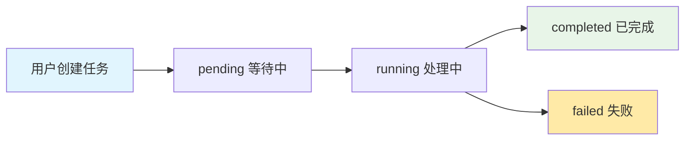

# ComfyUI Workflow Server API 接入文档

## 📋 目录

- [API 概览](#api-概览)
  - [简化架构](#-简化架构)
- [快速开始](#快速开始)
- [API 模块详解](#api-模块详解)
  - [风格管理模块](#风格管理模块)
  - [任务管理模块](#任务管理模块)
  - [文件管理模块](#文件管理模块)
- [WebSocket 实时推送](#websocket-实时推送)
- [错误处理](#错误处理)
- [代码示例](#代码示例)
- [最佳实践](#最佳实践)

---

## 🚀 API 概览

ComfyUI Workflow Server 提供了一套简化的 RESTful API 和 WebSocket 实时推送服务，专注于AI图像风格转换和工作流管理。

### 基础信息

- **基础URL**: `http://your-domain:8000/api/v1`
- **API版本**: v1
- **数据格式**: JSON
- **认证方式**: 无认证（简化微服务）
- **用户隔离**: 基于路径参数 `user_id`

### 功能特性

- 🎨 **风格管理**: 风格发现、搜索和应用
- 📋 **任务管理**: 异步任务处理和状态跟踪（按用户隔离）
- 📁 **文件管理**: 用户文件上传、管理和存储（按用户隔离）
- 🔌 **实时推送**: WebSocket 任务状态实时更新
- 📊 **任务监控**: 详细的任务进度和状态跟踪

### 🏗️ 简化架构

#### 微服务设计

本系统采用简化的微服务架构，专注于核心功能：

| 服务 | 说明 | 端口 |
|------|------|------|
| **ComfyUI Workflow Server** | 核心微服务，处理任务和文件管理 | 8000 |
| **Web Image Transform** | 轻量级Web客户端 | 8080 |

#### 用户隔离机制

- **路径隔离**: 通过URL路径参数 `user_id` 实现用户隔离
- **文件隔离**: 每个用户拥有独立的目录 (`/uploads/{user_id}/`, `/outputs/{user_id}/`)
- **任务隔离**: 用户只能查看和管理自己的任务
- **会话管理**: Web客户端使用 `session_id` 作为 `user_id`

#### API路径结构

```
/api/v1/
├── styles/                    # 全局风格管理（无需user_id）
├── users/{user_id}/
│   ├── files/                # 用户文件管理
│   └── tasks/                # 用户任务管理
└── ws/                       # WebSocket连接
    ├── push/{client_id}      # 推送端点
    └── {client_id}           # 客户端连接
```

---

## ⚡ 快速开始

### 1. 选择用户标识

由于系统采用简化架构，您只需要选择一个唯一的用户标识符：

```javascript
// Web应用示例：使用session ID作为user_id
const userId = sessionStorage.getItem('session_id') || generateSessionId();

// 移动应用示例：使用设备ID
const userId = getDeviceId();

// 桌面应用示例：使用用户输入或配置
const userId = getUserInput() || 'default_user';
```

### 2. 基础请求示例

```bash
# 获取所有风格（无需认证）
curl -X GET "http://your-domain:8000/api/v1/styles/"

# 上传文件（用户隔离）
curl -X POST "http://your-domain:8000/api/v1/users/alice/files/upload" \
     -F "file=@/path/to/image.jpg"

# 创建任务
curl -X POST "http://your-domain:8000/api/v1/users/alice/tasks" \
     -H "Content-Type: application/json" \
     -d '{"style_id": "anime_style", "image_url": "http://domain/uploads/alice/image.jpg"}'
```

### 3. WebSocket连接

```javascript
// 建立WebSocket连接接收实时更新
const clientId = `client_${Date.now()}`;
const ws = new WebSocket(`ws://your-domain:8000/api/v1/ws/${clientId}`);

ws.onmessage = (event) => {
    const data = JSON.parse(event.data);
    console.log('任务状态更新:', data);
};
```

---

## 📚 API 模块详解

### 风格管理模块

风格管理是全局共享的，无需用户隔离。

#### 1. 获取所有风格

**端点**: `GET /api/v1/styles/`

**描述**: 获取所有可用的风格列表。

**响应示例**:
```json
{
  "styles": [
    {
      "id": "clay_style_transform",
      "name": "黏土风格转换",
      "description": "将输入图像转换为黏土风格的图像，呈现可爱、3D、立体效果",
      "estimated_time": 45,
      "tags": ["黏土风格", "3D效果", "可爱"]
    },
    {
      "id": "anime_style_transform", 
      "name": "动漫风格转换",
      "description": "将输入图像转换为动漫风格的图像，呈现鲜艳色彩和漫画风格",
      "estimated_time": 45,
      "tags": ["动漫风格", "漫画", "动画"]
    }
  ]
}
```

#### 2. 搜索风格

**端点**: `GET /api/v1/styles/search?q={keyword}`

**参数**:
- `q` (string, required): 搜索关键词

**响应**: 与获取所有风格相同的格式

#### 3. 获取风格详情

**端点**: `GET /api/v1/styles/{style_id}`

**参数**:
- `style_id` (string, required): 风格ID

**响应示例**:
```json
{
  "id": "clay_style_transform",
  "name": "黏土风格转换", 
  "description": "将输入图像转换为黏土风格的图像，呈现可爱、3D、立体效果",
  "estimated_time": 45,
  "tags": ["黏土风格", "3D效果", "可爱"]
}
```

---

### 任务管理模块

> 📢 **用户隔离**: 所有任务操作都在用户命名空间下进行，用户只能访问自己的任务。

#### 任务生命周期



#### 1. 创建任务

**端点**: `POST /api/v1/users/{user_id}/tasks`

**路径参数**:
- `user_id` (string, required): 用户标识符

**请求体**:
```json
{
  "style_id": "clay_style_transform",
  "image_url": "http://your-domain:8000/uploads/alice/image.jpg"
}
```

**响应示例**:
```json
{
  "success": true,
  "task_id": "task_12345",
  "user_id": "alice",
  "estimated_time": 45
}
```

#### 2. 获取用户任务列表

**端点**: `GET /api/v1/users/{user_id}/tasks`

**路径参数**:
- `user_id` (string, required): 用户标识符

**查询参数**:
- `limit` (integer, optional): 返回任务数量限制，默认100

**响应示例**:
```json
{
  "success": true,
  "user_id": "alice",
  "tasks": [
    {
      "task_id": "task_12345",
      "user_id": "alice", 
      "style_id": "clay_style_transform",
      "status": "completed",
      "progress": 100.0,
      "created_at": 1640995200.123,
      "started_at": 1640995205.456,
      "completed_at": 1640995300.789,
      "estimated_remaining": 0,
      "error_message": null
    }
  ],
  "total": 1
}
```

#### 3. 获取任务详情

**端点**: `GET /api/v1/users/{user_id}/tasks/{task_id}`

**路径参数**:
- `user_id` (string, required): 用户标识符
- `task_id` (string, required): 任务ID

**响应**: 与任务列表中的单个任务相同格式

#### 4. 获取任务结果

**端点**: `GET /api/v1/users/{user_id}/tasks/{task_id}/result`

**描述**: 仅在任务状态为 `completed` 时可用。

**响应示例**:
```json
{
  "success": true,
  "data": {
    "output_images": [
      {
        "filename": "ComfyUI_00423_.png",
        "url": "http://127.0.0.1:8188/view?filename=ComfyUI_00423_.png&type=output", 
        "size": 1024000
      }
    ],
    "duration": 95.5,
    "style_applied": "clay_style_transform"
  }
}
```

---

### 文件管理模块

> 📢 **用户隔离**: 所有文件操作都在用户独立的命名空间中进行。

#### 文件存储结构

```
uploads/
├── alice/          # 用户alice的上传文件
│   ├── file_001.jpg
│   └── file_002.png
├── bob/            # 用户bob的上传文件
│   └── file_003.jpg

outputs/
├── alice/          # 用户alice的输出文件
│   ├── task_123_output.jpg
│   └── task_124_output.png
├── bob/            # 用户bob的输出文件
```

#### 1. 上传文件

**端点**: `POST /api/v1/users/{user_id}/files/upload`

**路径参数**:
- `user_id` (string, required): 用户标识符

**请求格式**: `multipart/form-data`

**文件限制**:
- 最大大小: 10MB
- 支持格式: .jpg, .jpeg, .png, .gif, .bmp, .webp

**请求示例**:
```bash
curl -X POST "http://your-domain:8000/api/v1/users/alice/files/upload" \
     -F "file=@/path/to/your/image.jpg"
```

**响应示例**:
```json
{
  "file_id": "file_67890"
}
```

#### 2. 获取用户文件列表

**端点**: `GET /api/v1/users/{user_id}/files`

**路径参数**:
- `user_id` (string, required): 用户标识符

**查询参数**:
- `limit` (integer, optional): 返回文件数量限制，默认100

**响应示例**:
```json
{
  "success": true,
  "user_id": "alice",
  "files": [
    {
      "file_id": "file_67890",
      "user_id": "alice",
      "filename": "image.jpg",
      "original_name": "my_photo.jpg",
      "url": "/uploads/alice/file_67890.jpg",
      "size": 512000,
      "created_at": 1640995200.123
    }
  ],
  "total": 1
}
```

#### 3. 获取文件详情

**端点**: `GET /api/v1/users/{user_id}/files/{file_id}`

**路径参数**:
- `user_id` (string, required): 用户标识符
- `file_id` (string, required): 文件ID

**响应**: 与文件列表中的单个文件相同格式

#### 4. 删除文件

**端点**: `DELETE /api/v1/users/{user_id}/files/{file_id}`

**响应示例**:
```json
{
  "success": true,
  "data": {
    "message": "文件 file_67890 已成功删除"
  }
}
```

#### 5. 获取用户统计

**端点**: `GET /api/v1/users/{user_id}/stats`

**响应示例**:
```json
{
  "success": true,
  "data": {
    "user_id": "alice",
    "task_counts": {
      "completed": 5,
      "failed": 1,
      "running": 0,
      "pending": 0
    },
    "file_counts": {
      "total": 25
    },
    "storage_used": 52428800
  }
}
```

---

## 🔌 WebSocket 实时推送

WebSocket系统提供任务状态的实时更新，支持两种连接方式：

### 1. 客户端连接（接收任务更新）

**连接地址**: `ws://your-domain:8000/api/v1/ws/{client_id}`

**参数**:
- `client_id` (string): 唯一的客户端标识符

### 2. 推送连接（服务间通信）

**连接地址**: `ws://your-domain:8000/api/v1/ws/push/{client_id}`

### 消息格式

**任务状态更新**:
```json
{
  "status": "running",
  "task_id": "task_12345", 
  "progress": 45.0,
  "message": "处理中... 步骤 12/25 (48.0%)",
  "estimated_remaining": 30,
  "current_step": 12,
  "total_steps": 25,
  "current_node": "73"
}
```

**任务完成消息**:
```json
{
  "status": "completed",
  "task_id": "task_12345",
  "progress": 100.0,
  "message": "图像转换完成！",
  "result": {
    "output_files": [
      {
        "filename": "ComfyUI_00423_.png",
        "url": "http://127.0.0.1:8188/view?filename=ComfyUI_00423_.png&type=output",
        "type": "image",
        "img_type": "output", 
        "priority": 1,
        "node_id": "35"
      }
    ],
    "task_id": "task_12345",
    "completed_at": null
  }
}
```

### JavaScript 示例

```javascript
class ComfyUIWebSocketClient {
    constructor(userId) {
        this.userId = userId;
        this.clientId = `client_${userId}_${Date.now()}`;
        this.ws = null;
        this.connect();
    }
    
    connect() {
        const wsUrl = `ws://your-domain:8000/api/v1/ws/${this.clientId}`;
        this.ws = new WebSocket(wsUrl);
        
        this.ws.onopen = () => {
            console.log('WebSocket连接已建立');
        };
        
        this.ws.onmessage = (event) => {
            const data = JSON.parse(event.data);
            this.handleTaskUpdate(data);
        };
        
        this.ws.onclose = () => {
            console.log('WebSocket连接已关闭');
            // 自动重连
            setTimeout(() => this.connect(), 3000);
        };
        
        this.ws.onerror = (error) => {
            console.error('WebSocket错误:', error);
        };
    }
    
    handleTaskUpdate(data) {
        const { status, task_id, progress, message } = data;
        
        console.log(`任务 ${task_id}: ${status} (${progress}%) - ${message}`);
        
        if (status === 'completed') {
            this.handleTaskCompleted(data);
        } else if (status === 'failed') {
            this.handleTaskFailed(data);
        }
    }
    
    handleTaskCompleted(data) {
        if (data.result && data.result.output_files) {
            const outputFile = data.result.output_files.find(f => f.img_type === 'output');
            if (outputFile) {
                console.log('任务完成，输出文件:', outputFile.url);
                this.displayResult(outputFile.url);
            }
        }
    }
    
    handleTaskFailed(data) {
        console.error('任务失败:', data.message);
    }
    
    displayResult(imageUrl) {
        // 显示结果图片的逻辑
        const img = document.getElementById('result-image');
        if (img) {
            img.src = imageUrl;
        }
    }
}

// 使用示例
const userId = 'alice';
const wsClient = new ComfyUIWebSocketClient(userId);
```

---

## ❌ 错误处理

### HTTP 状态码

| 状态码 | 说明 |
|--------|------|
| 200 | 请求成功 |
| 201 | 资源创建成功 |
| 202 | 请求已接受，异步处理中 |
| 400 | 请求参数错误 |
| 404 | 资源不存在 |
| 413 | 文件过大 |
| 422 | 参数验证失败 |
| 500 | 服务器内部错误 |

### 错误响应格式

```json
{
  "detail": "错误描述信息",
  "error_code": "SPECIFIC_ERROR_CODE"
}
```

### 常见错误

| 错误 | 说明 | 解决方案 |
|------|------|----------|
| FILE_TOO_LARGE | 文件过大 | 压缩文件至10MB以下 |
| INVALID_FILE_TYPE | 文件类型不支持 | 使用支持的图片格式 |
| TASK_NOT_FOUND | 任务不存在 | 检查任务ID和用户ID |
| STYLE_NOT_FOUND | 风格不存在 | 检查风格ID |
| USER_NOT_FOUND | 用户不存在 | 检查用户ID参数 |

---

## 💻 代码示例

### Python 完整示例

```python
import requests
import json
import time
import asyncio
import websockets

class ComfyUIClient:
    def __init__(self, base_url, user_id):
        self.base_url = base_url
        self.user_id = user_id
    
    def get_styles(self):
        """获取所有风格"""
        response = requests.get(f"{self.base_url}/api/v1/styles/")
        return response.json()
    
    def upload_file(self, file_path):
        """上传文件"""
        with open(file_path, 'rb') as f:
            files = {'file': f}
            response = requests.post(
                f"{self.base_url}/api/v1/users/{self.user_id}/files/upload",
                files=files
            )
        return response.json()
    
    def create_task(self, style_id, image_url):
        """创建转换任务"""
        data = {
            "style_id": style_id,
            "image_url": image_url
        }
        
        response = requests.post(
            f"{self.base_url}/api/v1/users/{self.user_id}/tasks",
            json=data
        )
        return response.json()
    
    def get_task_status(self, task_id):
        """获取任务状态"""
        response = requests.get(
            f"{self.base_url}/api/v1/users/{self.user_id}/tasks/{task_id}"
        )
        return response.json()
    
    def get_task_result(self, task_id):
        """获取任务结果"""
        response = requests.get(
            f"{self.base_url}/api/v1/users/{self.user_id}/tasks/{task_id}/result"
        )
        return response.json()
    
    def get_user_tasks(self, limit=100):
        """获取用户任务列表"""
        response = requests.get(
            f"{self.base_url}/api/v1/users/{self.user_id}/tasks?limit={limit}"
        )
        return response.json()
    
    async def websocket_listen(self, client_id=None):
        """监听WebSocket消息"""
        if not client_id:
            client_id = f"client_{self.user_id}_{int(time.time())}"
        
        uri = f"ws://{self.base_url.replace('http://', '')}/api/v1/ws/{client_id}"
        
        async with websockets.connect(uri) as websocket:
            print(f"WebSocket连接已建立: {client_id}")
            
            try:
                while True:
                    message = await websocket.recv()
                    data = json.loads(message)
                    print(f"收到任务更新: {data}")
                    
                    if data.get('status') == 'completed':
                        print(f"任务 {data['task_id']} 完成!")
                        if 'result' in data:
                            output_files = data['result'].get('output_files', [])
                            for file in output_files:
                                if file.get('img_type') == 'output':
                                    print(f"输出文件: {file['url']}")
                                    
            except websockets.exceptions.ConnectionClosed:
                print("WebSocket连接已关闭")

# 使用示例
async def main():
    # 创建客户端
    client = ComfyUIClient("http://localhost:8000", "alice")
    
    # 获取可用风格
    styles = client.get_styles()
    print("可用风格:", styles['styles'][0]['id'] if styles.get('styles') else "无")
    
    # 上传文件
    upload_result = client.upload_file("./test_image.jpg")
    print("文件上传结果:", upload_result)
    
    if upload_result.get('file_id'):
        # 构造图片URL
        image_url = f"http://localhost:8000/uploads/{client.user_id}/{upload_result['file_id']}.jpg"
        
        # 创建任务
        task_result = client.create_task("clay_style_transform", image_url)
        print("任务创建结果:", task_result)
        
        if task_result.get('success'):
            task_id = task_result['task_id']
            
            # 启动WebSocket监听（在后台运行）
            asyncio.create_task(client.websocket_listen())
            
            # 轮询任务状态
            while True:
                status = client.get_task_status(task_id)
                print(f"任务状态: {status}")
                
                if status['status'] in ['completed', 'failed']:
                    break
                    
                await asyncio.sleep(2)
            
            # 获取结果
            if status['status'] == 'completed':
                result = client.get_task_result(task_id)
                print("任务结果:", result)

# 运行示例
if __name__ == "__main__":
    asyncio.run(main())
```

### JavaScript 完整示例

```javascript
class ComfyUIClient {
    constructor(baseUrl, userId) {
        this.baseUrl = baseUrl;
        this.userId = userId;
    }

    async getStyles() {
        const response = await fetch(`${this.baseUrl}/api/v1/styles/`);
        return await response.json();
    }

    async uploadFile(file) {
        const formData = new FormData();
        formData.append('file', file);
        
        const response = await fetch(
            `${this.baseUrl}/api/v1/users/${this.userId}/files/upload`,
            {
                method: 'POST',
                body: formData
            }
        );
        
        return await response.json();
    }

    async createTask(styleId, imageUrl) {
        const response = await fetch(
            `${this.baseUrl}/api/v1/users/${this.userId}/tasks`,
            {
                method: 'POST',
                headers: {
                    'Content-Type': 'application/json'
                },
                body: JSON.stringify({
                    style_id: styleId,
                    image_url: imageUrl
                })
            }
        );
        
        return await response.json();
    }

    async getTaskStatus(taskId) {
        const response = await fetch(
            `${this.baseUrl}/api/v1/users/${this.userId}/tasks/${taskId}`
        );
        return await response.json();
    }

    async getTaskResult(taskId) {
        const response = await fetch(
            `${this.baseUrl}/api/v1/users/${this.userId}/tasks/${taskId}/result`
        );
        return await response.json();
    }

    connectWebSocket(onMessage) {
        const clientId = `client_${this.userId}_${Date.now()}`;
        const wsUrl = `ws://${this.baseUrl.replace('http://', '')}/api/v1/ws/${clientId}`;
        
        const ws = new WebSocket(wsUrl);
        
        ws.onopen = () => {
            console.log('WebSocket连接已建立');
        };
        
        ws.onmessage = (event) => {
            const data = JSON.parse(event.data);
            onMessage(data);
        };
        
        ws.onclose = () => {
            console.log('WebSocket连接已关闭');
        };
        
        ws.onerror = (error) => {
            console.error('WebSocket错误:', error);
        };
        
        return ws;
    }
}

// 使用示例
async function example() {
    const client = new ComfyUIClient('http://localhost:8000', 'alice');
    
    // 获取风格
    const styles = await client.getStyles();
    console.log('可用风格:', styles);
    
    // 建立WebSocket连接
    const ws = client.connectWebSocket((data) => {
        console.log('任务更新:', data);
        
        if (data.status === 'completed') {
            const outputFiles = data.result?.output_files || [];
            const outputFile = outputFiles.find(f => f.img_type === 'output');
            if (outputFile) {
                console.log('结果图片:', outputFile.url);
                displayResult(outputFile.url);
            }
        }
    });
    
    // 文件上传和任务创建
    const fileInput = document.getElementById('file-input');
    fileInput.addEventListener('change', async (event) => {
        const file = event.target.files[0];
        if (file) {
            // 上传文件
            const uploadResult = await client.uploadFile(file);
            console.log('上传结果:', uploadResult);
            
            if (uploadResult.file_id) {
                // 构造图片URL
                const imageUrl = `${client.baseUrl}/uploads/${client.userId}/${uploadResult.file_id}.jpg`;
                
                // 创建任务
                const taskResult = await client.createTask('clay_style_transform', imageUrl);
                console.log('任务创建:', taskResult);
            }
        }
    });
}

function displayResult(imageUrl) {
    const img = document.getElementById('result-image');
    if (img) {
        img.src = imageUrl;
        img.style.display = 'block';
    }
}

// 页面加载后运行
document.addEventListener('DOMContentLoaded', example);
```

---

## 🚀 最佳实践

### 1. 用户标识管理

- **唯一性**: 确保用户ID在系统中唯一
- **会话管理**: Web应用建议使用session ID作为用户标识
- **持久化**: 在本地存储用户ID以保持会话一致性

### 2. 错误处理

- **重试机制**: 对于网络错误实现指数退避重试
- **状态检查**: 始终检查HTTP状态码和响应内容
- **用户反馈**: 为用户提供清晰的错误信息

### 3. 性能优化

- **文件压缩**: 上传前适当压缩图片文件
- **并发控制**: 合理控制并发请求数量
- **缓存策略**: 缓存风格列表等静态数据

### 4. WebSocket 管理

- **心跳检测**: 定期发送ping消息保持连接
- **重连机制**: 实现自动重连处理网络断开
- **消息过滤**: 根据任务归属过滤WebSocket消息

### 5. 文件管理

- **格式验证**: 上传前验证文件格式和大小
- **进度显示**: 为文件上传提供进度指示
- **清理机制**: 定期清理不需要的临时文件

### 6. 任务监控

- **状态跟踪**: 实时跟踪任务状态变化
- **进度显示**: 为用户提供任务进度信息
- **结果处理**: 及时处理和显示任务结果

---