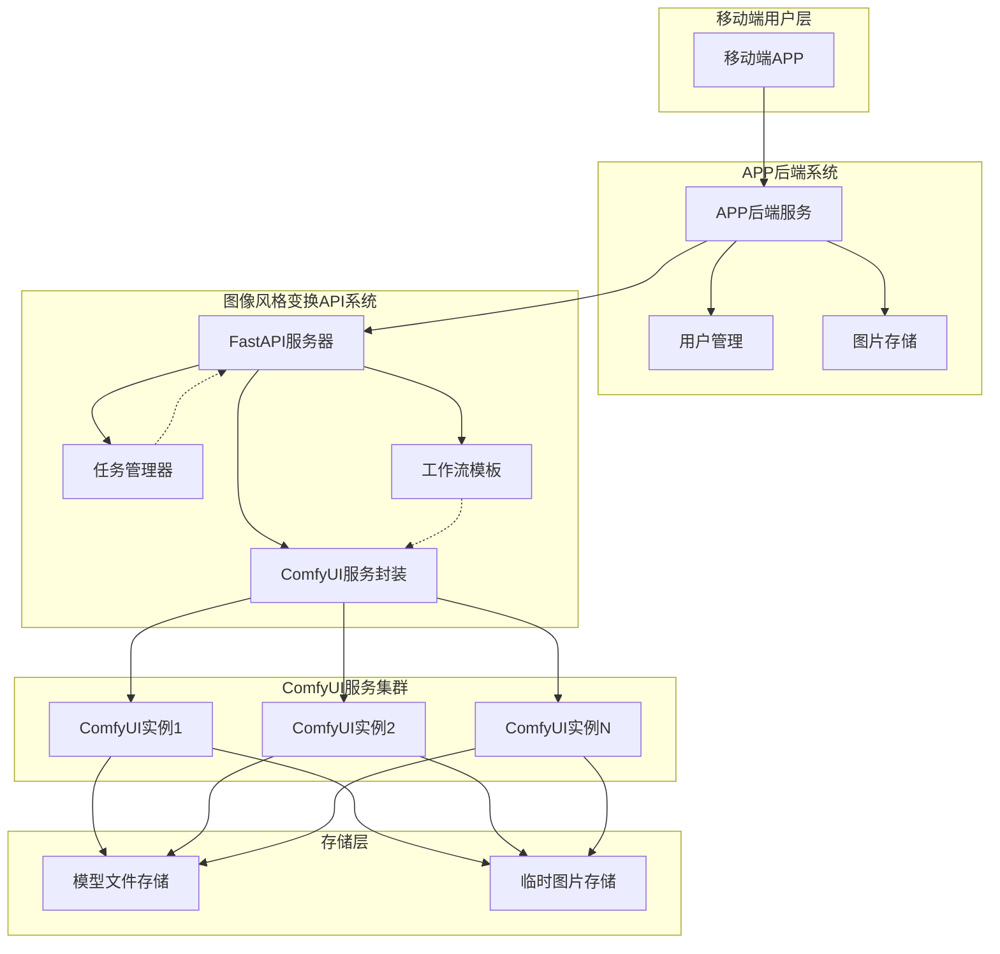
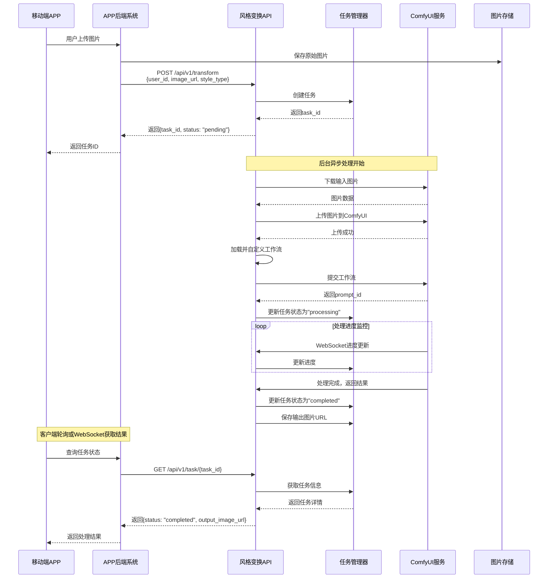

# 图像风格变换API服务

基于ComfyUI的图像风格变换API服务，专为移动端APP后端设计，支持多用户并发处理。

## 📋 目录

- [功能特性](#功能特性)
- [系统架构](#系统架构)
- [快速开始](#快速开始)
- [图生图处理流程](#图生图处理流程)
- [API接口](#api接口)
- [风格类型](#风格类型)
- [工作流配置](#工作流配置)
- [部署配置](#部署配置)
- [监控和日志](#监控和日志)
- [与APP后端集成](#与app后端集成)
- [性能优化](#性能优化)
- [故障排除](#故障排除)
- [开发指南](#开发指南)

## 功能特性

- 🎨 **多种风格变换**：支持Clay、Anime、Realistic、Cartoon、Oil Painting等风格
- 👥 **多用户支持**：基于user_id的用户隔离和任务管理
- 🚀 **异步处理**：后台异步处理，支持高并发
- 📊 **实时进度**：WebSocket实时进度反馈
- 🔄 **批量处理**：支持批量图像处理
- 📈 **任务管理**：完整的任务状态跟踪和历史记录
- 🐳 **容器化部署**：Docker和Docker Compose支持

## 系统架构

### 整体架构图



### 架构说明

本服务作为中间层，专注于图像风格变换处理：

**核心职责**：
- 🔗 **API网关**：提供RESTful接口
- 📋 **任务管理**：多用户任务队列和状态跟踪
- 🖼️ **图像处理**：下载、上传、格式转换
- ⚙️ **工作流管理**：动态自定义ComfyUI工作流
- 📊 **进度监控**：实时处理进度反馈

**设计原则**：
- ✅ **无状态设计**：不存储用户数据，只处理图像
- ✅ **异步处理**：后台任务，非阻塞响应
- ✅ **水平扩展**：支持多ComfyUI实例负载均衡
- ✅ **容错机制**：任务失败重试和错误处理

## 快速开始

### 1. 环境要求

- Python 3.11+
- ComfyUI服务运行在 `http://localhost:8188`
- Docker（可选）

### 2. 安装依赖

```bash
pip install -r requirements.txt
```

### 3. 配置环境变量

创建 `.env` 文件：

```env
DEBUG=true
LOG_LEVEL=INFO
COMFYUI_BASE_URL=http://localhost:8188
HOST=0.0.0.0
PORT=8000
```

### 4. 启动服务

```bash
python -m app.main
```

或使用Docker：

```bash
docker-compose up -d
```

### 5. 访问API文档

- Swagger UI: http://localhost:8000/docs
- ReDoc: http://localhost:8000/redoc

## 图生图处理流程

### 完整流程图



### 流程说明

#### 1. **任务提交阶段**
- 用户在移动端APP上传图片
- APP后端保存图片并调用风格变换API
- API立即返回任务ID，开始后台异步处理

#### 2. **图像预处理阶段**
- 从APP后端下载原始图片
- 验证图片格式和大小
- 上传图片到ComfyUI服务器

#### 3. **工作流执行阶段**
- 根据风格类型加载对应工作流模板
- 动态自定义工作流参数（提示词、强度等）
- 提交工作流到ComfyUI执行队列

#### 4. **进度监控阶段**
- 通过WebSocket实时接收处理进度
- 更新任务状态和进度百分比
- 处理可能的错误和异常

#### 5. **结果返回阶段**
- 获取ComfyUI生成的结果图片
- 构建图片访问URL
- 更新任务状态为完成
- 客户端通过轮询获取最终结果

## API接口

### 单张图像变换

```http
POST /api/v1/transform
Content-Type: application/json

{
    "user_id": "user_12345",
    "image_url": "https://example.com/input.jpg",
    "style_type": "clay",
    "custom_prompt": "Clay Style, lovely, 3d, cute",
    "strength": 0.6
}
```

### 批量图像变换

```http
POST /api/v1/transform/batch
Content-Type: application/json

{
    "user_id": "user_12345",
    "image_urls": [
        "https://example.com/input1.jpg",
        "https://example.com/input2.jpg"
    ],
    "style_type": "anime",
    "strength": 0.7
}
```

### 查询任务状态

```http
GET /api/v1/task/{task_id}
```

### 获取用户任务列表

```http
GET /api/v1/user/{user_id}/tasks?limit=50
```

## 风格类型

| 风格类型 | 描述 | 预设提示词 |
|---------|------|-----------|
| clay | 粘土风格 | Clay Style, lovely, 3d, cute |
| anime | 动漫风格 | Anime Style, beautiful, detailed |
| realistic | 写实风格 | Realistic Style, high quality, detailed |
| cartoon | 卡通风格 | Cartoon Style, colorful, fun |
| oil_painting | 油画风格 | Oil Painting Style, artistic, classical |

## 工作流配置

系统使用 `app/workflows/style_change.json` 作为基础工作流模板。如果您有自定义的ComfyUI工作流，请：

1. 将工作流JSON文件放置在 `app/workflows/` 目录
2. 修改 `app/services/comfyui_service.py` 中的 `customize_workflow` 方法
3. 确保工作流包含必要的节点：LoadImage、CLIPTextEncode、KSampler、SaveImage

## 部署配置

### Docker部署

```bash
# 构建镜像
docker build -t style-transform-api .

# 运行容器
docker run -d \
  --name style-transform-api \
  -p 8000:8000 \
  -e COMFYUI_BASE_URL=http://your-comfyui-server:8188 \
  style-transform-api
```

### Docker Compose部署

```bash
docker-compose up -d
```

### 环境变量配置

| 变量名 | 默认值 | 描述 |
|--------|--------|------|
| DEBUG | false | 调试模式 |
| LOG_LEVEL | INFO | 日志级别 |
| COMFYUI_BASE_URL | http://localhost:8188 | ComfyUI服务地址 |
| HOST | 0.0.0.0 | 服务器地址 |
| PORT | 8000 | 服务器端口 |
| MAX_CONCURRENT_TASKS | 10 | 最大并发任务数 |
| TASK_CLEANUP_HOURS | 24 | 任务清理时间（小时） |

## 监控和日志

### 健康检查

```http
GET /health
```

返回服务状态和ComfyUI连接状态。

### 系统统计

```http
GET /api/v1/stats
```

返回任务统计信息。

### 日志配置

日志级别可通过 `LOG_LEVEL` 环境变量配置：
- DEBUG: 详细调试信息
- INFO: 一般信息（推荐）
- WARNING: 警告信息
- ERROR: 错误信息

## 与APP后端集成

### 集成架构

您的APP后端系统与风格变换API的集成非常简单，只需要HTTP调用：

```
APP后端 ──HTTP──> 风格变换API ──WebSocket──> ComfyUI
   │                    │
   ├── 用户管理          ├── 任务管理
   ├── 图片存储          ├── 进度跟踪  
   └── 业务逻辑          └── 结果处理
```

### 集成代码示例

**Python/FastAPI后端集成**：
```python
import aiohttp
import asyncio
import time
from typing import Dict, Any

class StyleTransformService:
    def __init__(self, api_base_url: str = "http://style-api:8000"):
        self.api_base_url = api_base_url
    
    async def transform_image(self, user_id: str, image_url: str, 
                            style_type: str = "clay") -> Dict[str, Any]:
        """提交图像变换任务"""
        async with aiohttp.ClientSession() as session:
            async with session.post(
                f"{self.api_base_url}/api/v1/transform",
                json={
                    "user_id": user_id,
                    "image_url": image_url,
                    "style_type": style_type,
                    "strength": 0.6
                }
            ) as response:
                return await response.json()
    
    async def get_task_status(self, task_id: str) -> Dict[str, Any]:
        """查询任务状态"""
        async with aiohttp.ClientSession() as session:
            async with session.get(
                f"{self.api_base_url}/api/v1/task/{task_id}"
            ) as response:
                return await response.json()
    
    async def wait_for_completion(self, task_id: str, 
                                timeout: int = 300) -> Dict[str, Any]:
        """等待任务完成"""
        start_time = time.time()
        while time.time() - start_time < timeout:
            result = await self.get_task_status(task_id)
            if result["status"] == "completed":
                return result
            elif result["status"] == "failed":
                raise Exception(f"任务失败: {result.get('error_message')}")
            await asyncio.sleep(2)
        raise TimeoutError("任务超时")

# 使用示例
style_service = StyleTransformService()

@app.post("/user/transform-image")
async def transform_user_image(user_id: str, image_file: UploadFile):
    # 1. 保存用户上传的图片
    image_url = await save_user_image(image_file)
    
    # 2. 调用风格变换API
    result = await style_service.transform_image(user_id, image_url, "clay")
    
    # 3. 返回任务ID给客户端
    return {"task_id": result["task_id"], "status": "processing"}

@app.get("/user/task/{task_id}")
async def get_transform_result(task_id: str):
    # 查询任务状态
    result = await style_service.get_task_status(task_id)
    return result
```

**Node.js/Express后端集成**：
```javascript
const axios = require('axios');

class StyleTransformService {
    constructor(apiBaseUrl = 'http://style-api:8000') {
        this.apiBaseUrl = apiBaseUrl;
    }
    
    async transformImage(userId, imageUrl, styleType = 'clay') {
        try {
            const response = await axios.post(
                `${this.apiBaseUrl}/api/v1/transform`,
                {
                    user_id: userId,
                    image_url: imageUrl,
                    style_type: styleType,
                    strength: 0.6
                }
            );
            return response.data;
        } catch (error) {
            throw new Error(`变换失败: ${error.message}`);
        }
    }
    
    async getTaskStatus(taskId) {
        try {
            const response = await axios.get(
                `${this.apiBaseUrl}/api/v1/task/${taskId}`
            );
            return response.data;
        } catch (error) {
            throw new Error(`查询失败: ${error.message}`);
        }
    }
}

// 使用示例
const styleService = new StyleTransformService();

app.post('/user/transform-image', async (req, res) => {
    const { userId, imageUrl, styleType } = req.body;
    
    try {
        const result = await styleService.transformImage(userId, imageUrl, styleType);
        res.json({ taskId: result.task_id, status: 'processing' });
    } catch (error) {
        res.status(500).json({ error: error.message });
    }
});

app.get('/user/task/:taskId', async (req, res) => {
    try {
        const result = await styleService.getTaskStatus(req.params.taskId);
        res.json(result);
    } catch (error) {
        res.status(500).json({ error: error.message });
    }
});
```

### 集成要点

1. **异步处理**：风格变换是耗时操作，建议使用异步模式
2. **状态轮询**：客户端需要定期查询任务状态
3. **错误处理**：处理网络错误、任务失败等异常情况
4. **超时管理**：设置合理的超时时间
5. **用户体验**：向用户显示处理进度和预估时间

### 最佳实践

#### 1. 任务状态管理
```python
# 推荐的状态轮询实现
async def poll_task_status(task_id: str, callback=None):
    """轮询任务状态直到完成"""
    while True:
        status = await style_service.get_task_status(task_id)
        
        if callback:
            await callback(status)  # 更新UI进度
            
        if status["status"] == "completed":
            return status["output_image_url"]
        elif status["status"] == "failed":
            raise Exception(status.get("error_message", "任务失败"))
            
        await asyncio.sleep(2)  # 2秒轮询一次
```

#### 2. 批量处理优化
```python
# 批量任务处理
async def process_batch_images(user_id: str, image_urls: list):
    """批量处理图像"""
    batch_result = await style_service.transform_batch(
        user_id, image_urls, "clay"
    )
    
    # 并发等待所有任务完成
    tasks = []
    for task_result in batch_result["results"]:
        task = poll_task_status(task_result["task_id"])
        tasks.append(task)
    
    results = await asyncio.gather(*tasks, return_exceptions=True)
    return results
```

#### 3. 错误重试机制
```python
import asyncio
from tenacity import retry, stop_after_attempt, wait_exponential

@retry(
    stop=stop_after_attempt(3),
    wait=wait_exponential(multiplier=1, min=4, max=10)
)
async def robust_transform_image(user_id: str, image_url: str):
    """带重试机制的图像变换"""
    return await style_service.transform_image(user_id, image_url)
```

## 性能优化

### 并发处理

- 使用FastAPI的后台任务进行异步处理
- 支持多个ComfyUI实例负载均衡
- 内存任务管理，避免数据库开销

### 缓存策略

- 工作流模板缓存
- 图像下载缓存（可选）
- 结果URL缓存

### 资源管理

- 自动清理过期任务
- 内存使用监控
- 连接池管理

## 故障排除

### 常见问题

1. **ComfyUI连接失败**
   - 检查ComfyUI服务是否运行
   - 验证COMFYUI_BASE_URL配置
   - 检查网络连接

2. **图像下载失败**
   - 验证图像URL可访问性
   - 检查图像格式支持
   - 确认网络权限

3. **工作流执行失败**
   - 检查ComfyUI模型文件
   - 验证工作流JSON格式
   - 查看ComfyUI日志

### 日志分析

```bash
# 查看容器日志
docker logs style-transform-api

# 实时日志
docker logs -f style-transform-api
```

## 开发指南

### 项目结构

```
style_transform_api/
├── app/
│   ├── api/              # API路由
│   ├── schemas/          # Pydantic模型
│   ├── services/         # 业务逻辑
│   ├── utils/           # 工具函数
│   ├── workflows/       # 工作流模板
│   ├── config.py        # 配置管理
│   └── main.py          # 应用入口
├── comfyui_client/      # ComfyUI客户端库
├── requirements.txt     # 依赖文件
├── Dockerfile          # Docker配置
└── docker-compose.yml  # Docker Compose配置
```

### 扩展开发

1. **添加新风格**：在 `schemas/request.py` 中添加新的风格类型
2. **自定义工作流**：修改 `services/comfyui_service.py` 中的工作流处理逻辑
3. **添加新API**：在 `api/` 目录下创建新的路由模块

## 许可证

MIT License

## 支持

如有问题或建议，请提交Issue或联系开发团队。 